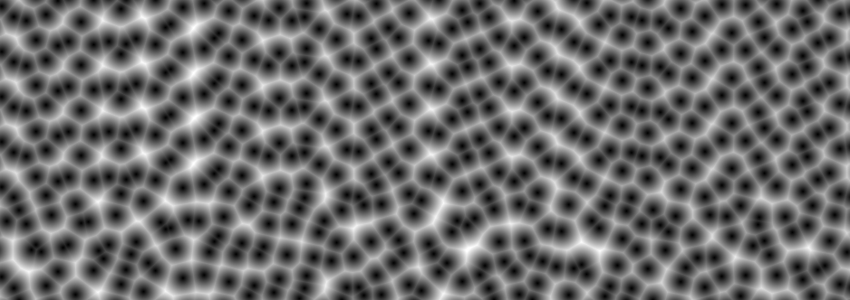

# Voronoi SIMD 
This project began after I wanted to generate voronoi noise and wanted to use the experimental `std::simd` module. 
Profiling has revealed my SIMD implementation to be around twice as slow as my non-SIMD implementation. 

This project is known to compile on `rustc 1.85.0-nightly (4363f9b6f 2025-01-02)`. 



## Performance
`voronoi_basic_*` generates noise in individual cells, which involves evaluating the cell's neighbours' centre points. 
This results in redundant computation among neighbouring cells. 
It may be possible to achieve greater efficiency by generating noise in a grid, but this is as-yet unexplored. 

Benchmarking using FNV-1a:
```
test voronoi::tests::bench_voronoi_basic           ... bench:          66.28 ns/iter (+/- 4.48)
test voronoi::tests::bench_voronoi_basic_simd      ... bench:         109.78 ns/iter (+/- 7.96)
test voronoi::tests::bench_voronoi_basic_1000      ... bench:      65,100.10 ns/iter (+/- 3,371.87)
test voronoi::tests::bench_voronoi_basic_1000_simd ... bench:     110,775.37 ns/iter (+/- 8,414.36)
```

## Noise Quality 
The non-SIMD voronoi noise function can be customized with different hashing functions. 
SipHash, rust's default hashing algorithm, produces high-quality noise. 
FxHash produces artifacted noise, as seen in the noise higher on this page. 
FnvHash produces similarly poor results. 
The author's inexperience with hashing may contribute to these results. 
